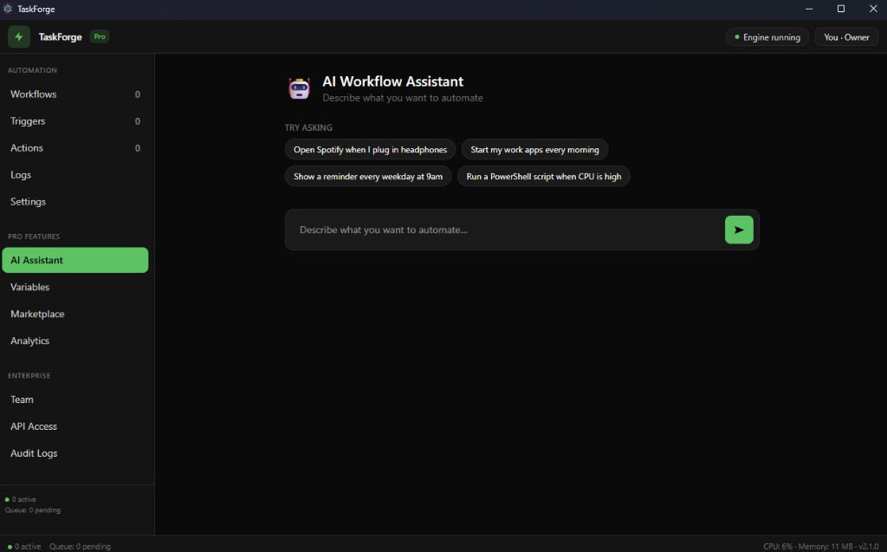
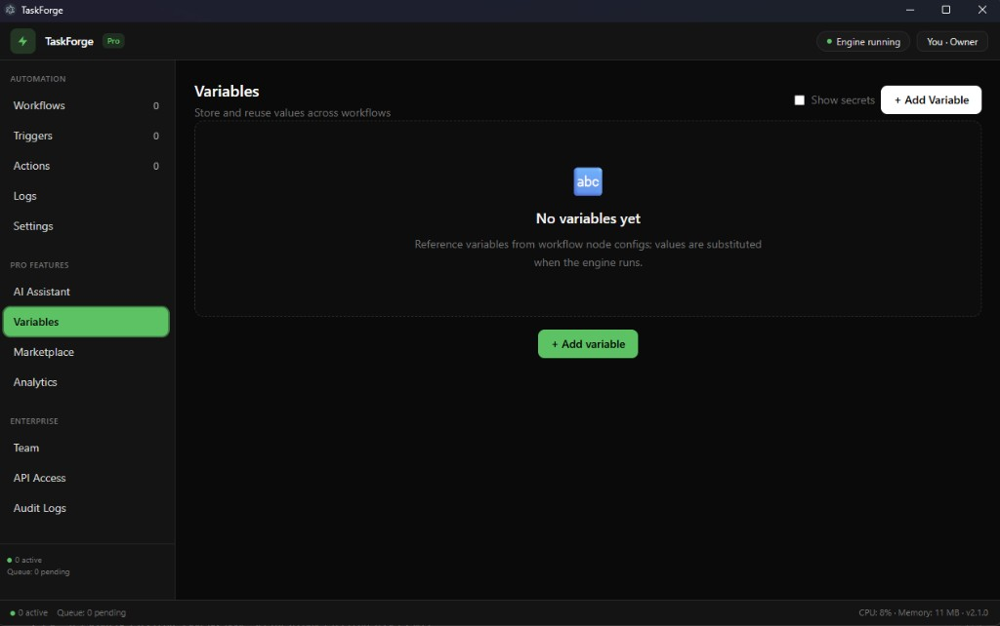
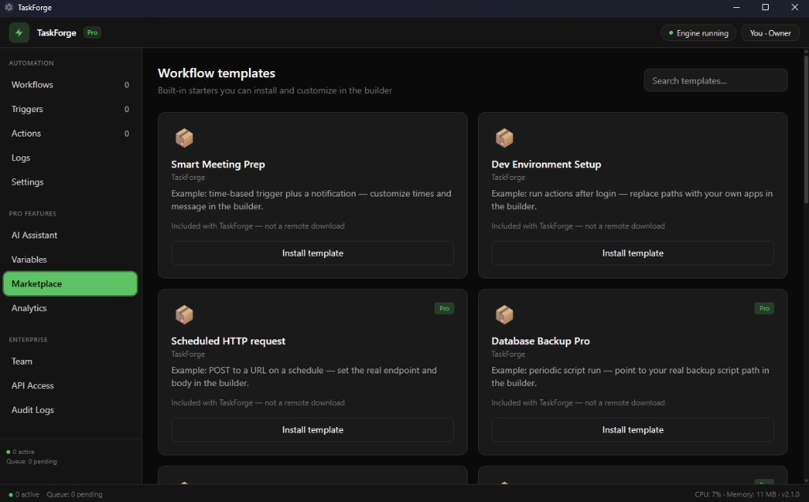
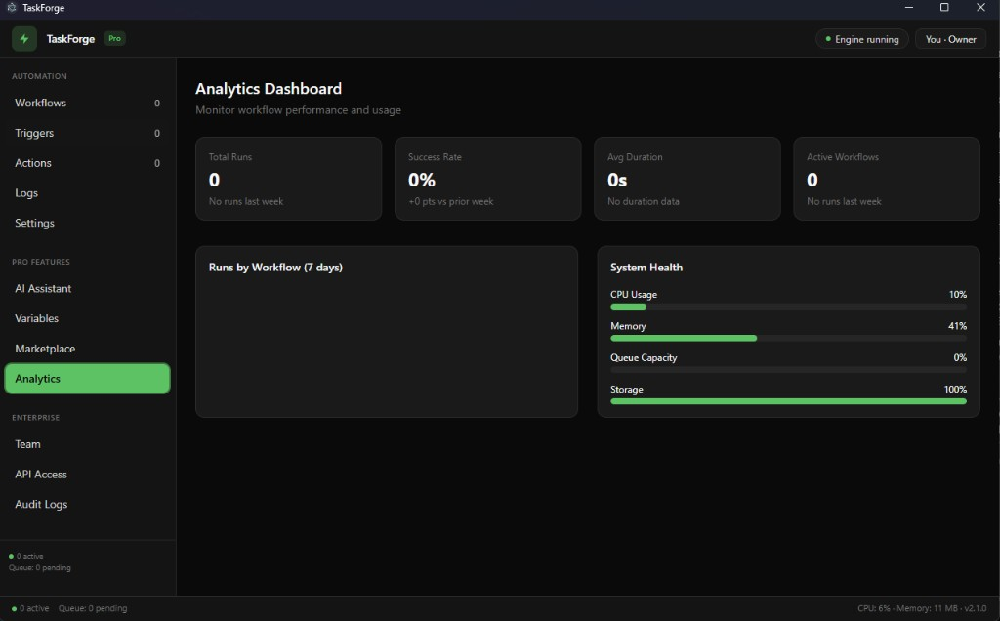
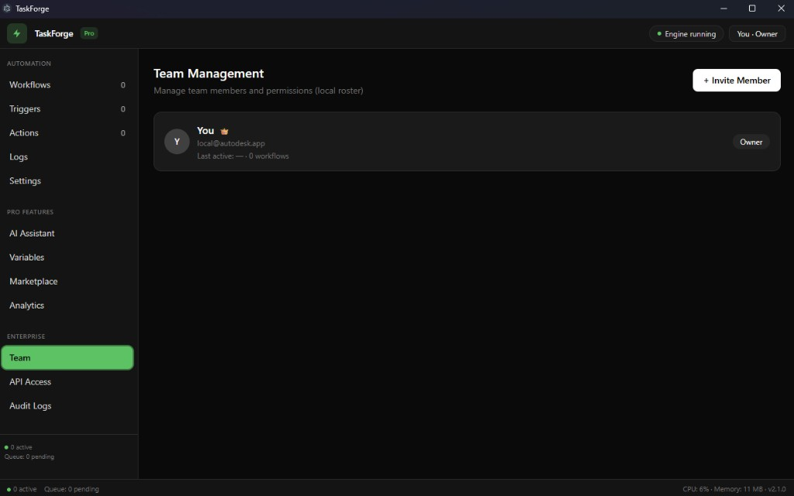
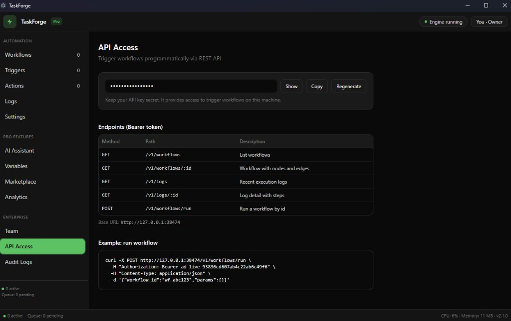
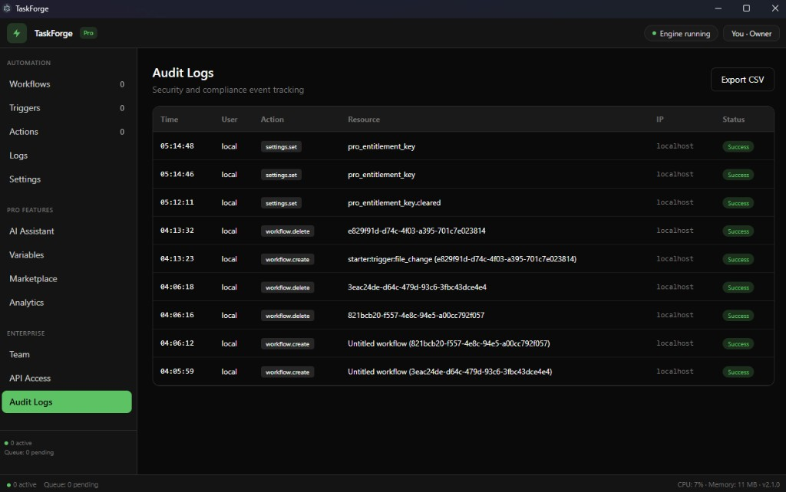

# TaskForge

Modern desktop automation for Windows — a **Task Scheduler–style** app with a visual workflow builder, triggers, actions, execution logs, and optional AI-assisted drafts.

## Screenshots

TaskForge desktop app (v2.1.0).

### Core (Free tier)

| Workflows | Triggers |
|:---:|:---:|
|  |  |

| Actions | Execution logs |
|:---:|:---:|
|  |  |

| Settings (organization license & preferences) |
|:---:|
|  |

### Pro features

Unlocked with an **organization license key** (see [`PLAN.md`](PLAN.md) §20). Screenshots also show **advanced** trigger/action catalog entries available in Pro.

| AI Workflow Assistant | Variables |
|:---:|:---:|
|  |  |

| Marketplace (templates) | Analytics dashboard |
|:---:|:---:|
|  |  |

### Enterprise features

Same license tier as Pro for IPC unlock; **Team**, **API Access**, and **Audit Logs** are grouped under Enterprise in the app.

| Team management | API Access (local REST) |
|:---:|:---:|
|  |  |

| Audit logs |
|:---:|
|  |

The **Free** tier includes core automation (workflows, basic triggers/actions, logs, settings). **Pro** and **Enterprise** capabilities (AI Assistant, Variables, Marketplace, Analytics, Team, API Access, Audit Logs, advanced triggers/actions) require an **organization license key**; see [`PLAN.md`](PLAN.md) §20 for entitlement and optional online validation.

## Stack

- **Electron** (main process + preload)
- **Angular 19** (standalone components, lazy routes)
- **Tailwind CSS v4**
- **SQLite** (`better-sqlite3`) for workflows, logs, variables, audit trail
- **Express** local API (`127.0.0.1:38474`) to trigger workflows with a Bearer token

## Scripts

| Command | Description |
|--------|-------------|
| `npm start` | Angular dev server only (browser; IPC mocked) |
| `npm run electron:dev` | Angular `ng serve` + Electron with hot reload against `http://127.0.0.1:4200` |
| `npm run build:all` | Production Angular build + compile Electron `dist-electron/` |
| `npm run electron` | Compile Electron and launch (loads built Angular from `dist/`) |
| `npm run electron:dist` | Build + Windows NSIS installer via `electron-builder` |
| `npm run rebuild:native` | Recompile `better-sqlite3` for the installed **Electron** Node ABI (run after `npm install` or upgrading Electron) |

## Development

1. Install dependencies: `npm install` (runs `@electron/rebuild` for `better-sqlite3` via the `electron-rebuild` CLI).
2. Run `npm run electron:dev` — wait for the UI, then use the app.
3. **`npm start` (Angular only):** Settings and API Access show **dummy keys** for UI layout (`src/app/core/local-dev-keys.ts`). They are not sent to OpenAI. The REST placeholder authenticates **unpackaged** Electron only (`npm run electron` / `electron:dev`); **packaged** installs require the real `tf_live_…` key from the database.
4. Data file: `%APPDATA%/TaskForge/taskforge.db` (Electron `userData`). If you upgraded from an older install, SQLite may be copied once from the legacy paths defined in [`electron/legacy-paths.ts`](electron/legacy-paths.ts) (historical `%APPDATA%` folder names on disk).

If the window never opens and the console shows `NODE_MODULE_VERSION` / “compiled against a different Node.js version”, run `npm run rebuild:native` so the native module matches Electron (not your system Node).

**Legacy strings:** [`electron/legacy-paths.ts`](electron/legacy-paths.ts) and [`src/app/core/legacy-onboarding-key.ts`](src/app/core/legacy-onboarding-key.ts) are the only places that still embed historical folder names, SQLite filenames, `localStorage` keys, email, or dev HMAC material from pre-TaskForge installs. They exist so migrations keep working; everything else uses TaskForge naming.

## Auto-updates

`electron-updater` runs `checkForUpdatesAndNotify()` when `app.isPackaged` is true. Configure `publish` in `electron-builder` (e.g. GitHub releases) for production updates.

## API example

```bash
curl -X POST http://127.0.0.1:38474/v1/workflows/run \
  -H "Authorization: Bearer YOUR_API_KEY" \
  -H "Content-Type: application/json" \
  -d "{\"workflow_id\":\"YOUR_WORKFLOW_ID\",\"params\":{}}"
```

Retrieve or regenerate the key in **Enterprise → API Access** (requires an active Pro/Enterprise license).

## License

TaskForge is released under the [**GNU General Public License v3.0**](LICENSE) (**GPL-3.0**). See the license file for the full terms.

If you distribute modified versions, follow the GPL’s source-offer and license-preservation requirements. Combining this code with proprietary services or add-ons may require careful separation and legal review.

Copyright © 2026 Jared Scarito.

---

### Publishing on GitHub — checklist

- **Build:** `npm run build && npm run build:electron` should pass.
- **Secrets:** Do not commit production `TASKFORGE_ENTITLEMENT_SECRET`, API keys, or signing certificates; use CI secrets for release builds.
- **Plan vs UI:** The app references “PLAN.md §20” in the sidebar; keeping `PLAN.md` in the repo keeps that accurate for contributors.
